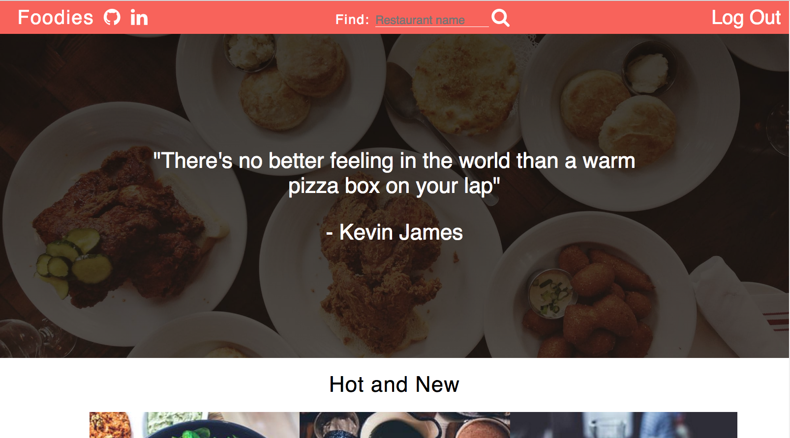
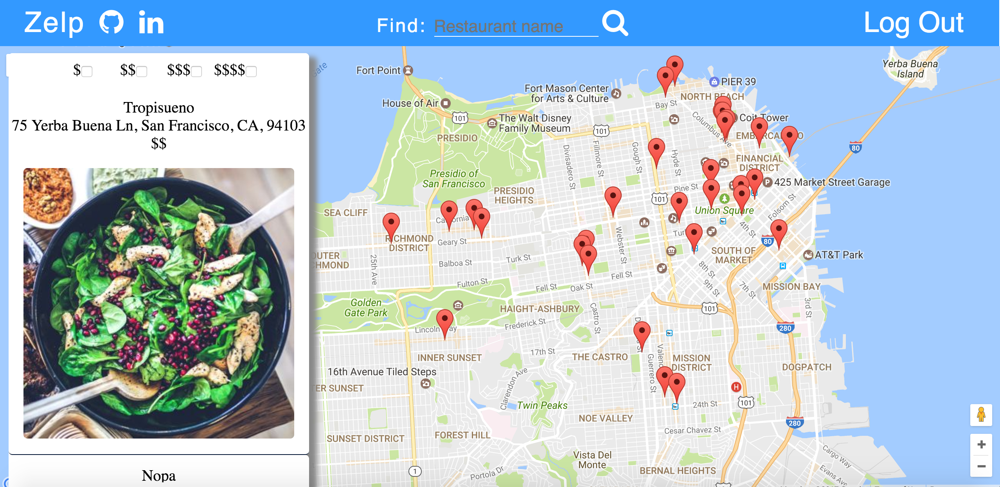
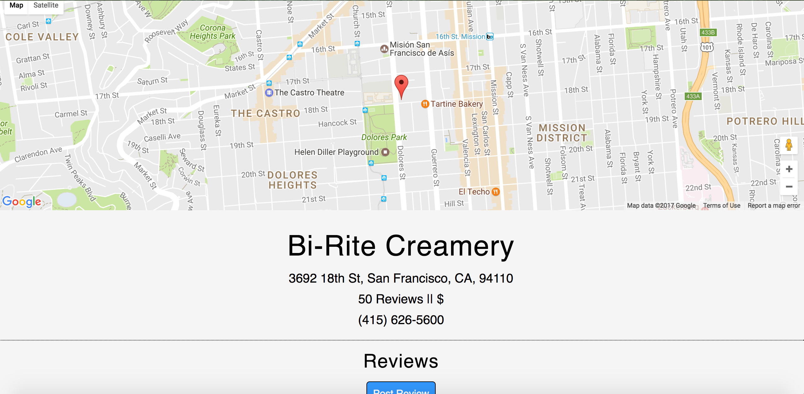

# Zelp

[Heroku Live][heroku]

[heroku]: https://zelpapp.herokuapp.com/

Zelp is a full-stack web application inspired by Yelp, utilizing
Ruby on Rails for the backend, a PostgreSQL database, and a React with Redux
architectural framework for the front end. Zelp helps users find
restaurants located within San Francisco, CA.



Please see the [docs][docs] folder for a look at the design documentation.

[docs]: https://github.com/ryanmora/YelpClone/tree/master/docs

## Features and Implementation

### Places

Zelp allows users to search for places by name and/or filter
places based on price. Each place's information is stored in
a `places` table. Some of the columns within the table are `name`,
`price`, and `address`. Please see the [db schema][schema] for an in
depth look at the database.

[schema]: /docs/schema.md

A list of places are stored in the state as an object, where the key
of the object is the place's `id` and the value is the place object.

* `PlaceIndex`: This component is displayed after the user searches
for a restaurant. Based on the search query, only the filtered restaurants will be displayed on the map. If no search query is entered, all restaurants will be loaded. The map is rendered using Google Maps API and is centered on San Francisco. Each place in the left column is a link that redirects to the place's show page.



* `PlaceShow`: This component is displayed after the user clicks on a certain place in the `PlaceIndex` component. The component displays more detailed about the place and also contains a `ReviewIndex` and a `ReviewForm` component. The "Post Review" button loads a modal that allows users to post a review. The review allows users to give a rating, description and an optional photo if desired.



### Search Bar & Filtering

Users can search for places by name. Search results will return places that have the specified query within the place name. Additionally users can filter places based on pricing.

* Search is handled on the backend, through the `PlacesController`.
When a user searches for a place name the query is passed to the  `PlacesController`. The `PlacesController` also handles filtering the places based on price filters. `params[:price]` represents an object where the keys represent the price, ranging from one to four and the are boolean values representing whether a price filter is applied.

```ruby
#places_controller
def index
  @places = Place.all
  if params[:query]
    @places = Place.search(params[:query], @places)
  elsif params[:price] && params[:price].any?{|k, v| v == "true"}
    prices = []
    params[:price].each do |k, v|
      prices.push(k.to_i) if v == "true"
    end

    @places = Place.where('price IN (?)', prices)
  end
  render :index
end
```

* The `PlacesController` then makes a call to the place model where the results are filtered based on the query.

```ruby
#place.rb
def self.search(query, places)
  processed_query = "%" + query.split.join("%") + "%"
  places.where("name ILIKE :query", query: processed_query)
end
```

## Future Directions for the Project

### User Profiles

Users will be able to view their personal profile, which will contain a
profile picture, past reviews, and any restaurants they have bookmarked.
In order to implement this I plan to add more columns to the `Users` table.
Additionally I plan to add a show action to the `UsersController` that will
display a user's profile page.

### Adding Places

Users will be able to add places. I plan to implement this by adding a create action to the `PlacesController`. Additionally I plan to allow a user to interact with a map to get the address of the place.
